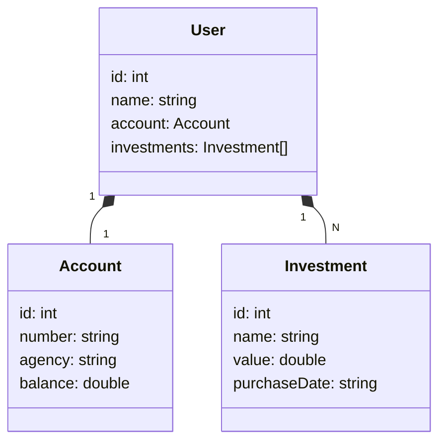

# Introdução 🚀🚀🚀

Este README documenta a API de Investimentos, que fornece recursos para gerenciar usuários e seus investimentos. A API é RESTful e utiliza o formato JSON para comunicação.

## Rotas 🗺️

- GET /users/all: Retorna uma lista de todos os usuários junto com seus investimentos e sua conta.
- POST /users: Cria um novo usuário.
- GET /users/{id}: Recupera um usuário específico por ID.
- DELETE /users/{id}: Exclui um usuário específico por ID.

## Exemplo json para o Post 🤖

```
{
    "id": 1,
    "name": "Liane",
    "account": {
        "id": 1,
        "number": "vcvfffxxxxxx44xee",
        "agency": "Americanas",
        "balance": 2000.00
    },
    "investments": [
        {
            "id": 1,
            "name": "PRET4",
            "value": 226.00,
            "purchaseDate": "2023-07-07"
        },
        {
            "id": 2,
            "name": "AMR3",
            "value": 26.00,
            "purchaseDate": "2023-07-07T"
        }
    ]
}
```
## Diagrama de classes 🤖

